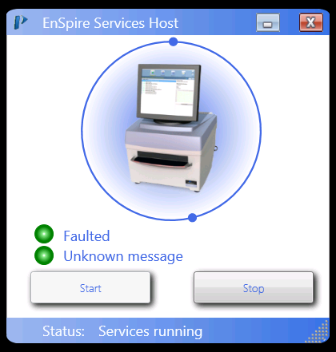

# enspire_control
`enspire_control` is a package for programmatic control of the EnSpire multimodal plate reader from PerkinElmer (formerly Wallac). The package currently only supports running fluorescence scan assays! It needs to be extended to support more than that. It works by directly modifying the database which holds all the data and settings of the instrument. This package works for me but may not work for other installations.
## Installation
* Backup the database.
* Clone the repo. 
* Create a protocol named `enspire_control`. This is the protocol which this package will modify. 
* Make sure the "Enspire Services Host" is running: <br>

* Try running some examples from the included notebook.

## EnpireWebClient
Part of the package is a command line tool for running and monitoring the assays on the reader through the automation interface (Enspire Services Host). This uses some obscure Microsoft protocol on top of SOAP and I was not able to establish communication from Python. I was therefore forced to build this minimal tool in C#.

usage:
```
EnSpireWebClient.exe <command> [<args>]
```

available commands:
* __help__ - get this help message
* __list__ - list available protocols
* __run \<name\>__ - run protocol <name>, wait until it finishes (currently `OnExportDone` callback)
* __runasync \<name\>__ - run protocol <name>, return immediately
* __listen__ - listen for callbacks until ctrl-C
* __probe__ - listen and call `get_CurrentState()` every second
